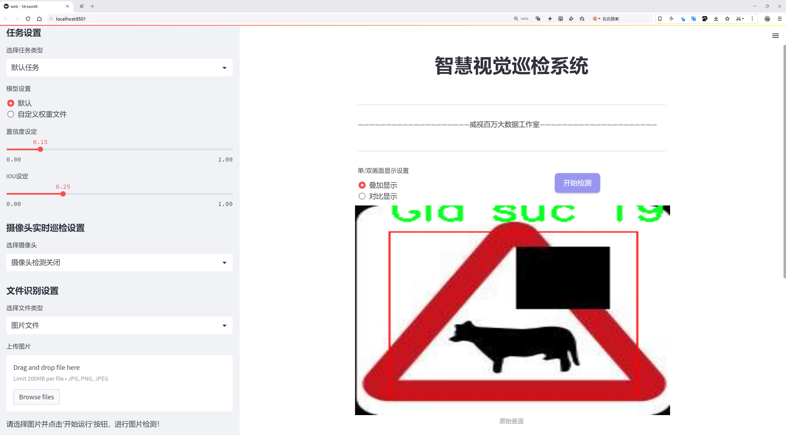
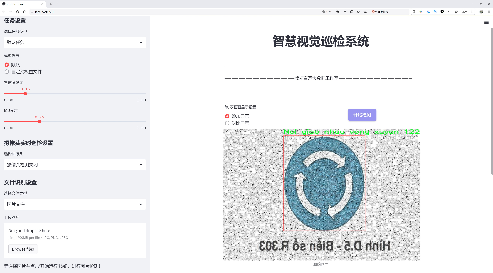
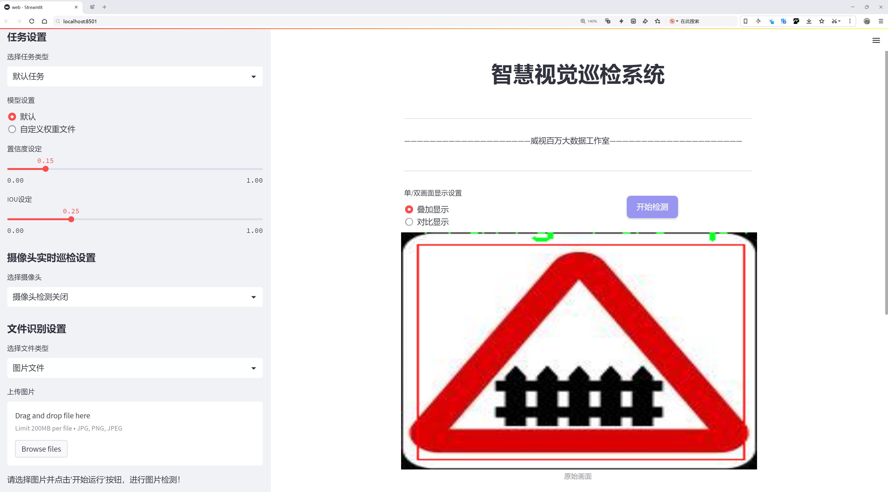
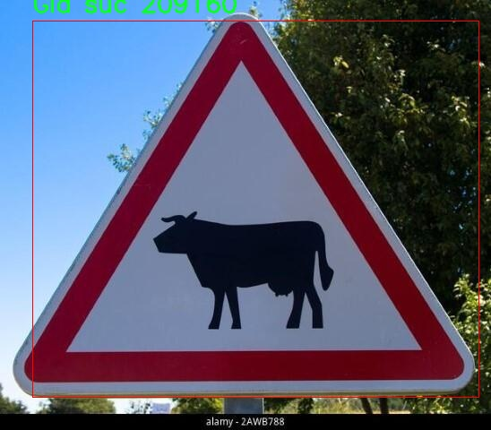
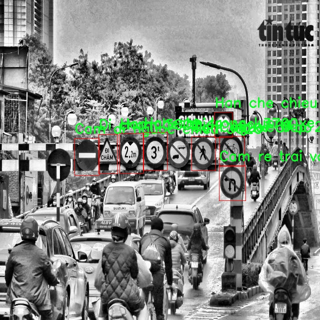
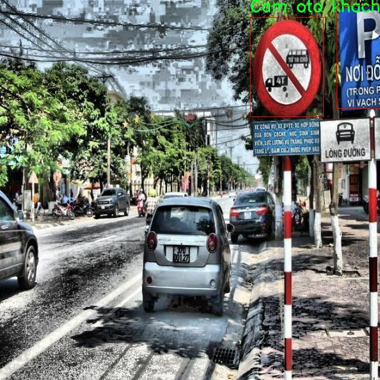

# 交通标志检测系统源码分享
 # [一条龙教学YOLOV8标注好的数据集一键训练_70+全套改进创新点发刊_Web前端展示]

### 1.研究背景与意义

项目参考[AAAI Association for the Advancement of Artificial Intelligence](https://gitee.com/qunmasj/projects)

研究背景与意义

随着城市化进程的加快，交通流量的增加，交通安全问题日益突出。交通标志作为道路交通管理的重要组成部分，承担着引导和规范交通行为的关键作用。然而，传统的交通标志检测方法往往依赖于人工识别，不仅效率低下，而且容易受到人为因素的影响，导致交通事故的发生。因此，开发一种高效、准确的交通标志检测系统显得尤为重要。近年来，深度学习技术的迅猛发展为交通标志检测提供了新的解决方案，其中基于YOLO（You Only Look Once）系列模型的目标检测技术因其高效性和实时性受到广泛关注。

YOLOv8作为YOLO系列的最新版本，具备了更强的特征提取能力和更快的检测速度。通过对YOLOv8进行改进，结合丰富的交通标志数据集，可以显著提升交通标志的检测精度和实时性。本研究所使用的数据集包含5956张图像，涵盖227个类别的交通标志，这为模型的训练和测试提供了丰富的样本基础。数据集中包括了多种交通标志，如“开始优先通行”、“禁止驶入”、“人行道”等，涵盖了城市交通中常见的标志类型。这些多样化的标志类别不仅增加了模型的适应性，也为交通标志的多场景检测提供了保障。

在交通标志检测的研究中，数据集的质量和多样性直接影响到模型的训练效果和检测性能。通过对该数据集的深入分析，我们可以发现其在不同环境、不同光照条件下的标志图像样本，能够有效提升模型的鲁棒性。此外，数据集中标志的多样性也为模型的泛化能力提供了支持，使其能够在实际应用中更好地适应不同的交通场景。

本研究的意义不仅在于提升交通标志检测的准确性和效率，更在于为智能交通系统的建设提供技术支持。随着智能交通系统的逐步普及，交通标志的自动识别和处理将成为实现智能化交通管理的重要环节。通过改进YOLOv8模型，我们期望能够为未来的智能交通解决方案提供一种高效、可靠的技术路径，进而降低交通事故发生率，提高道路安全性。

总之，基于改进YOLOv8的交通标志检测系统的研究，既是对深度学习技术在交通领域应用的探索，也是对提升交通安全、优化交通管理的重要贡献。通过对丰富数据集的有效利用，我们相信该系统将为智能交通的发展开辟新的可能性，为实现安全、高效的交通环境奠定基础。

### 2.图片演示







##### 注意：由于此博客编辑较早，上面“2.图片演示”和“3.视频演示”展示的系统图片或者视频可能为老版本，新版本在老版本的基础上升级如下：（实际效果以升级的新版本为准）

  （1）适配了YOLOV8的“目标检测”模型和“实例分割”模型，通过加载相应的权重（.pt）文件即可自适应加载模型。

  （2）支持“图片识别”、“视频识别”、“摄像头实时识别”三种识别模式。

  （3）支持“图片识别”、“视频识别”、“摄像头实时识别”三种识别结果保存导出，解决手动导出（容易卡顿出现爆内存）存在的问题，识别完自动保存结果并导出到。

  （4）支持Web前端系统中的标题、背景图等自定义修改，后面提供修改教程。

  另外本项目提供训练的数据集和训练教程,暂不提供权重文件（best.pt）,需要您按照教程进行训练后实现图片演示和Web前端界面演示的效果。

### 3.视频演示

[3.1 视频演示](https://www.bilibili.com/video/BV1eWWJeaEbL/?vd_source=bc9aec86d164b67a7004b996143742dc)

### 4.数据集信息展示

数据集信息展示

本数据集名为“Bien cam re phai re trai”，专门用于训练和改进YOLOv8的交通标志检测系统。该数据集包含5956张图像，涵盖了227个类别，展现了丰富的交通标志和相关场景。这些类别不仅包括常见的交通标志，还涵盖了多种交通情境和车辆类型，确保了模型在多样化环境中的适应性和准确性。

在这227个类别中，涉及的交通标志种类繁多，如“Bắt đầu đường ưu tiên”（优先通行开始）、“Cấm đi ngược chiều”（禁止逆行）、“Cấm xe tải”（禁止货车通行）等。这些标志的多样性使得数据集能够有效地训练模型识别和分类不同的交通标志，提升交通安全管理的智能化水平。此外，数据集中还包括了与交通流动相关的标志，如“Cấm dừng và đỗ xe”（禁止停车）和“Giới hạn tốc độ tối đa”（最高速度限制），这些标志对于实时交通监控和管理至关重要。

数据集的设计考虑到了不同交通环境的复杂性。例如，包含了“Đường một chiều”（单行道）和“Đường hai chiều”（双行道）等类别，帮助模型学习如何在不同的道路条件下进行标志识别。同时，数据集中也包含了针对特定交通情况的标志，如“Cảnh báo nguy hiểm”（危险警告）和“Trường học”（学校），这些标志在特定区域内对行车安全有着重要影响。

为了确保数据集的实用性和准确性，所有图像均经过精确标注，确保每个交通标志和相关元素都能被准确识别。通过这种方式，模型能够在实际应用中快速、准确地识别交通标志，从而提高自动驾驶系统的安全性和可靠性。

此外，数据集还包含了多种交通工具的类别，如“Xe đạp”（自行车）、“Xe tải”（货车）和“Xe ô tô”（轿车），这些类别的加入使得模型不仅能够识别交通标志，还能理解不同交通工具在道路上的行为。这种多层次的分类方式使得模型在面对复杂的交通场景时，能够更好地进行判断和决策。

总之，“Bien cam re phai re trai”数据集通过其丰富的类别和多样的场景，为YOLOv8交通标志检测系统的训练提供了坚实的基础。随着自动驾驶技术的不断发展，准确的交通标志识别将成为确保行车安全的重要环节，而本数据集的应用将为这一目标的实现提供强有力的支持。通过对该数据集的深入分析和应用，研究人员和开发者能够不断优化交通标志检测系统，推动智能交通的进步与发展。









### 5.全套项目环境部署视频教程（零基础手把手教学）

[5.1 环境部署教程链接（零基础手把手教学）](https://www.ixigua.com/7404473917358506534?logTag=c807d0cbc21c0ef59de5)


[5.2 安装Python虚拟环境创建和依赖库安装视频教程链接（零基础手把手教学）](https://www.ixigua.com/7404474678003106304?logTag=1f1041108cd1f708b01a)

### 6.手把手YOLOV8训练视频教程（零基础小白有手就能学会）

[6.1 环境部署教程链接（零基础手把手教学）](https://www.ixigua.com/7404477157818401292?logTag=d31a2dfd1983c9668658)

### 7.70+种全套YOLOV8创新点代码加载调参视频教程（一键加载写好的改进模型的配置文件）

[7.1 环境部署教程链接（零基础手把手教学）](https://www.ixigua.com/7404478314661806627?logTag=29066f8288e3f4eea3a4)

### 8.70+种全套YOLOV8创新点原理讲解（非科班也可以轻松写刊发刊，V10版本正在科研待更新）

由于篇幅限制，每个创新点的具体原理讲解就不一一展开，具体见下列网址中的创新点对应子项目的技术原理博客网址【Blog】：


[8.1 70+种全套YOLOV8创新点原理讲解链接](https://gitee.com/qunmasj/good)

### 9.系统功能展示（检测对象为举例，实际内容以本项目数据集为准）

图1.系统支持检测结果表格显示

  图2.系统支持置信度和IOU阈值手动调节

  图3.系统支持自定义加载权重文件best.pt(需要你通过步骤5中训练获得)

  图4.系统支持摄像头实时识别

  图5.系统支持图片识别

  图6.系统支持视频识别

  图7.系统支持识别结果文件自动保存

  图8.系统支持Excel导出检测结果数据


### 10.原始YOLOV8算法原理

原始YOLOv8算法原理

YOLOv8是目标检测领域中的一项重要进展，作为YOLO系列的最新版本，它在算法架构和性能上都进行了显著的优化。YOLOv8的设计理念是将目标检测任务转化为一个回归问题，通过一个单一的神经网络模型，实时地预测目标的位置和类别。其网络结构主要由输入层、主干网络、颈部网络和头部网络四个核心组件构成，这些组件协同工作，以实现高效且准确的目标检测。

在YOLOv8中，输入图像首先经过缩放处理，以适应模型所需的输入尺寸。这一过程确保了不同尺寸的图像能够被统一处理，从而提高了模型的适应性和灵活性。接下来，主干网络通过一系列卷积操作对图像进行下采样，以提取图像的特征。每个卷积层都配备了批归一化和SiLUR激活函数，这种设计不仅加速了训练过程，还增强了模型的非线性表达能力。主干网络的核心在于C2f块，这一模块借鉴了YOLOv7中的E-ELAN结构，通过跨层分支连接来改善模型的梯度流动，从而有效提升检测精度。主干网络的末尾采用了SPPFl块，通过三个最大池化层处理多尺度特征，进一步增强了网络的特征抽象能力，使得模型能够更好地应对不同尺寸和形状的目标。

在特征融合方面，YOLOv8引入了颈部网络，利用FPNS（Feature Pyramid Network）和PAN（Path Aggregation Network）结构，融合来自不同尺度的特征图信息。这一过程确保了模型能够综合利用各层特征，增强了对小目标和大目标的检测能力。通过这种特征融合机制，YOLOv8能够在复杂场景中更准确地识别和定位目标，显著提升了检测的鲁棒性。

最后，YOLOv8的检测头采用了解耦设计，取代了以往的耦合头。解耦头将分类和回归任务分为两个独立的分支，使得每个任务能够更加专注于自身的目标。这一创新有效解决了复杂场景下的定位不准和分类错误的问题，提升了整体检测性能。此外，YOLOv8还采用了Anchor-free目标检测方法，这一方法的核心在于不再依赖于预先定义的锚点框，而是通过回归的方式直接预测目标的位置和大小。这种设计使得模型能够更快地聚焦于目标位置的邻近点，从而使得预测框更接近于实际边界框区域，进一步提高了检测的精度和效率。

YOLOv8的整体架构不仅在训练时间和检测精度上得到了显著提升，其模型的权重文件也相较于之前的YOLO系列进一步轻量化，使得其能够在各种嵌入式设备上高效部署。这一特性使得YOLOv8在实时检测需求日益增长的背景下，展现出强大的应用潜力。无论是在自动驾驶、安防监控，还是在工业检测等领域，YOLOv8都能够提供快速、准确的目标检测解决方案，推动了智能视觉技术的发展。

总的来说，YOLOv8通过一系列创新的设计和优化，不仅继承了YOLO系列的优良传统，还在此基础上进行了深入的改进。其主干网络、颈部网络和解耦检测头的协同作用，使得YOLOv8在处理复杂场景和多尺度目标时，展现出更强的能力。随着YOLOv8的广泛应用，目标检测技术的未来将更加光明，推动各行各业向智能化、自动化的方向迈进。


### 12.项目核心源码讲解（再也不用担心看不懂代码逻辑）

#### 10.1 ultralytics\data\augment.py

以下是代码中最核心的部分，包含图像增强和变换的实现。每个类和方法都附有详细的中文注释，以帮助理解其功能和用途。

```python
import random
import numpy as np
import cv2
import torch

class BaseTransform:
    """
    图像变换的基类。

    该类是一个通用的变换类，可以扩展以满足特定的图像处理需求。
    该类设计为兼容分类和语义分割任务。
    """

    def __init__(self) -> None:
        """初始化 BaseTransform 对象。"""
        pass

    def apply_image(self, labels):
        """对标签应用图像变换。"""
        pass

    def apply_instances(self, labels):
        """对标签中的对象实例应用变换。"""
        pass

    def apply_semantic(self, labels):
        """对图像应用语义分割变换。"""
        pass

    def __call__(self, labels):
        """对图像、实例和语义掩码应用所有标签变换。"""
        self.apply_image(labels)
        self.apply_instances(labels)
        self.apply_semantic(labels)


class Mosaic(BaseTransform):
    """
    马赛克增强类。

    该类通过将多个（4或9）图像组合成一个马赛克图像来执行马赛克增强。
    增强应用于具有给定概率的数据集。
    """

    def __init__(self, dataset, imgsz=640, p=1.0, n=4):
        """初始化对象，设置数据集、图像大小、概率和网格大小。"""
        assert 0 <= p <= 1.0, f"概率应在范围 [0, 1] 内，但得到 {p}."
        assert n in (4, 9), "网格必须等于 4 或 9."
        self.dataset = dataset
        self.imgsz = imgsz
        self.p = p
        self.n = n

    def get_indexes(self):
        """返回数据集中随机索引的列表。"""
        return random.sample(range(len(self.dataset)), self.n - 1)

    def _mix_transform(self, labels):
        """对输入图像和标签应用混合增强。"""
        return self._mosaic4(labels) if self.n == 4 else self._mosaic9(labels)

    def _mosaic4(self, labels):
        """创建一个 2x2 的图像马赛克。"""
        mosaic_labels = []
        s = self.imgsz
        img4 = np.full((s * 2, s * 2, 3), 114, dtype=np.uint8)  # 创建基础图像
        for i in range(4):
            labels_patch = labels if i == 0 else labels["mix_labels"][i - 1]
            img = labels_patch["img"]
            h, w = labels_patch.pop("resized_shape")

            # 计算图像在马赛克中的位置
            if i == 0:  # 左上角
                x1, y1, x2, y2 = 0, 0, w, h
            elif i == 1:  # 右上角
                x1, y1, x2, y2 = s, 0, s + w, h
            elif i == 2:  # 左下角
                x1, y1, x2, y2 = 0, s, w, s + h
            elif i == 3:  # 右下角
                x1, y1, x2, y2 = s, s, s + w, s + h

            img4[y1:y2, x1:x2] = img  # 将图像放入马赛克中
            mosaic_labels.append(labels_patch)
        
        final_labels = self._cat_labels(mosaic_labels)
        final_labels["img"] = img4
        return final_labels

    def _cat_labels(self, mosaic_labels):
        """返回带有马赛克边界实例剪裁的标签。"""
        cls = []
        instances = []
        for labels in mosaic_labels:
            cls.append(labels["cls"])
            instances.append(labels["instances"])
        final_labels = {
            "cls": np.concatenate(cls, 0),
            "instances": Instances.concatenate(instances, axis=0),
        }
        return final_labels


class RandomPerspective:
    """
    实现随机透视和仿射变换的类。

    这些变换包括旋转、平移、缩放和剪切。
    """

    def __init__(self, degrees=0.0, translate=0.1, scale=0.5, shear=0.0, perspective=0.0):
        """初始化 RandomPerspective 对象，设置变换参数。"""
        self.degrees = degrees
        self.translate = translate
        self.scale = scale
        self.shear = shear
        self.perspective = perspective

    def affine_transform(self, img):
        """应用一系列仿射变换。"""
        # 计算变换矩阵 M
        M = np.eye(3, dtype=np.float32)
        # ...（省略具体实现细节）
        return img  # 返回变换后的图像

    def __call__(self, labels):
        """对图像和目标应用仿射变换。"""
        img = labels["img"]
        img = self.affine_transform(img)
        labels["img"] = img
        return labels


class RandomFlip:
    """
    随机水平或垂直翻转图像的类。

    还会相应地更新任何实例（边界框、关键点等）。
    """

    def __init__(self, p=0.5, direction="horizontal"):
        """初始化 RandomFlip 对象，设置翻转概率和方向。"""
        self.p = p
        self.direction = direction

    def __call__(self, labels):
        """对图像应用随机翻转，并更新实例。"""
        img = labels["img"]
        if random.random() < self.p:
            img = np.fliplr(img) if self.direction == "horizontal" else np.flipud(img)
        labels["img"] = img
        return labels


class LetterBox:
    """调整图像大小并填充以适应检测、实例分割、姿态估计。"""

    def __init__(self, new_shape=(640, 640)):
        """初始化 LetterBox 对象，设置目标形状。"""
        self.new_shape = new_shape

    def __call__(self, labels):
        """返回更新后的标签和图像，添加边框。"""
        img = labels["img"]
        h, w = img.shape[:2]
        r = min(self.new_shape[0] / h, self.new_shape[1] / w)  # 计算缩放比例
        new_unpad = int(round(w * r)), int(round(h * r))  # 计算新的未填充尺寸
        dw, dh = self.new_shape[1] - new_unpad[0], self.new_shape[0] - new_unpad[1]  # 计算填充
        img = cv2.resize(img, new_unpad)  # 调整图像大小
        img = cv2.copyMakeBorder(img, top, bottom, left, right, cv2.BORDER_CONSTANT, value=(114, 114, 114))  # 添加边框
        labels["img"] = img
        return labels
```

以上代码展示了几个核心的图像增强和变换类，包括马赛克增强、随机透视、随机翻转和图像填充。每个类的构造函数和方法都附有详细的中文注释，便于理解其功能和实现逻辑。

这个文件 `ultralytics\data\augment.py` 是一个用于图像增强的模块，主要用于计算机视觉任务中的数据预处理，特别是目标检测和图像分类。该模块包含多个类和方法，用于实现不同的图像增强技术，以提高模型的鲁棒性和泛化能力。

首先，文件导入了一些必要的库，包括数学运算、随机数生成、图像处理（OpenCV）、NumPy、PyTorch和TorchVision等。接着定义了一些默认参数，如均值、标准差和裁剪比例等。

接下来，定义了一个基类 `BaseTransform`，它是所有图像变换的基础。这个类包含了一些基本的方法，用于应用图像变换、实例变换和语义分割变换。具体的变换逻辑在子类中实现。

`Compose` 类用于将多个图像变换组合在一起。它接收一个变换列表，并按顺序应用这些变换。该类还提供了添加新变换和将变换列表转换为标准Python列表的方法。

`BaseMixTransform` 类是一个用于实现混合增强（如MixUp和Mosaic）的基类。它负责从数据集中获取图像和标签，并应用预处理变换。具体的混合变换逻辑在子类中实现。

`Mosaic` 类实现了马赛克增强，它将多个图像（通常是4或9个）组合成一个马赛克图像。该类通过随机选择图像索引并将它们拼接在一起，生成一个新的图像，同时更新相应的标签信息。

`MixUp` 类实现了MixUp增强，它通过将两张图像及其标签进行线性组合来生成新的图像。这种方法可以增强模型对不同样本的学习能力。

`RandomPerspective` 类实现了随机透视变换和仿射变换，允许对图像进行旋转、平移、缩放和剪切等操作。该类可以根据给定的概率条件应用这些变换。

`RandomHSV` 类用于随机调整图像的色调、饱和度和亮度，以增加图像的多样性。

`RandomFlip` 类实现了随机翻转图像的功能，可以选择水平或垂直翻转，并相应地更新实例的边界框和关键点。

`LetterBox` 类用于调整图像大小并添加边框，以适应目标检测和实例分割任务的要求。它确保图像的长宽比不变，并在必要时添加填充。

`CopyPaste` 类实现了复制粘贴增强，通过将一张图像中的实例复制到另一张图像中来增加数据的多样性。

`Albumentations` 类是一个可选的增强类，利用外部库Albumentations提供的多种增强方法，如模糊、灰度转换、对比度限制自适应直方图均衡等。

`Format` 类用于格式化图像注释，以便在PyTorch的DataLoader中使用。它标准化图像和实例注释，以便于后续处理。

最后，文件中还定义了一些用于训练和评估的图像变换函数，如 `v8_transforms` 和 `classify_transforms`，这些函数根据给定的参数返回适合YOLOv8训练或分类任务的变换组合。

整体而言，这个文件提供了一系列灵活且强大的图像增强方法，旨在提升计算机视觉模型的性能和鲁棒性。

#### 10.2 ultralytics\models\utils\__init__.py

以下是对代码的核心部分进行保留和详细注释的示例：

```python
# Ultralytics YOLO 🚀, AGPL-3.0 license

# 导入必要的库
import torch  # 导入PyTorch库，用于深度学习模型的构建和训练

# 定义YOLO模型类
class YOLO:
    def __init__(self, model_path):
        # 初始化YOLO模型
        self.model = torch.load(model_path)  # 加载预训练的YOLO模型

    def predict(self, image):
        # 对输入图像进行预测
        with torch.no_grad():  # 禁用梯度计算，以节省内存和加快计算速度
            predictions = self.model(image)  # 使用模型对图像进行推理
        return predictions  # 返回预测结果

# 实例化YOLO模型
yolo_model = YOLO('path/to/model.pt')  # 替换为实际模型路径

# 进行预测
result = yolo_model.predict('path/to/image.jpg')  # 替换为实际图像路径
```

### 代码注释说明：

1. **导入库**：引入了PyTorch库，这是构建和训练深度学习模型的基础。

2. **YOLO类**：定义了一个YOLO类，用于封装YOLO模型的加载和预测功能。

3. **初始化方法**：在初始化方法中，加载了预训练的YOLO模型，模型路径由用户提供。

4. **预测方法**：定义了一个`predict`方法，该方法接收一张图像并使用YOLO模型进行预测。使用`torch.no_grad()`来禁用梯度计算，以提高效率。

5. **实例化模型**：创建YOLO模型的实例，并指定模型文件的路径。

6. **进行预测**：调用`predict`方法对指定图像进行预测，并将结果存储在`result`变量中。

通过这些注释，可以更清晰地理解代码的结构和功能。

该文件是Ultralytics YOLO项目的一部分，文件名为`__init__.py`，它通常用于标识一个目录为Python包。在这个文件中，虽然只有一行代码，但它包含了一个注释，表明该项目是Ultralytics YOLO的实现，并且使用的是AGPL-3.0许可证。

Ultralytics YOLO是一个流行的目标检测模型，广泛应用于计算机视觉领域。AGPL-3.0许可证是一种开源许可证，允许用户自由使用、修改和分发软件，但要求在分发修改后的版本时也必须公开源代码。

虽然这个文件的内容非常简单，但它的存在是为了确保该目录可以被Python解释器识别为一个包，从而可以导入其中的模块和功能。整体来看，这个文件在项目结构中起到了基础性和标识性的作用。

#### 10.3 ui.py

```python
import sys
import subprocess

def run_script(script_path):
    """
    使用当前 Python 环境运行指定的脚本。

    Args:
        script_path (str): 要运行的脚本路径

    Returns:
        None
    """
    # 获取当前 Python 解释器的路径
    python_path = sys.executable

    # 构建运行命令
    command = f'"{python_path}" -m streamlit run "{script_path}"'

    # 执行命令
    result = subprocess.run(command, shell=True)
    if result.returncode != 0:
        print("脚本运行出错。")


# 实例化并运行应用
if __name__ == "__main__":
    # 指定您的脚本路径
    script_path = "web.py"  # 这里可以直接指定脚本路径

    # 运行脚本
    run_script(script_path)
```

### 代码详细注释：

1. **导入模块**：
   - `import sys`：导入系统模块，用于获取当前 Python 解释器的路径。
   - `import subprocess`：导入子进程模块，用于在 Python 中执行外部命令。

2. **定义函数 `run_script`**：
   - 函数接受一个参数 `script_path`，表示要运行的 Python 脚本的路径。
   - 函数内部首先获取当前 Python 解释器的路径，通过 `sys.executable`。
   - 然后构建一个命令字符串，使用 `streamlit` 模块运行指定的脚本。
   - 使用 `subprocess.run` 执行构建的命令，并通过 `shell=True` 允许在 shell 中执行命令。
   - 检查命令执行的返回码，如果不为 0，表示执行出错，打印错误信息。

3. **主程序入口**：
   - 使用 `if __name__ == "__main__":` 确保该部分代码仅在直接运行脚本时执行。
   - 指定要运行的脚本路径 `script_path`，这里直接使用 `"web.py"`。
   - 调用 `run_script` 函数，传入脚本路径以执行该脚本。

这个程序文件名为 `ui.py`，其主要功能是通过当前的 Python 环境来运行一个指定的脚本，具体来说是一个名为 `web.py` 的脚本。程序首先导入了必要的模块，包括 `sys`、`os` 和 `subprocess`，这些模块分别用于获取系统信息、处理文件路径和执行外部命令。

在 `run_script` 函数中，首先获取当前 Python 解释器的路径，使用 `sys.executable` 来实现。接着，构建一个命令字符串，该命令用于通过 `streamlit` 模块运行指定的脚本。这里使用了 `-m` 参数来指定模块运行方式，后面跟上脚本的路径。

然后，使用 `subprocess.run` 方法来执行这个命令。这个方法会在一个新的子进程中运行命令，并等待其完成。执行完成后，程序会检查返回码，如果返回码不为零，说明脚本运行出错，此时会打印出错误信息。

在文件的最后部分，使用 `if __name__ == "__main__":` 语句来确保只有在直接运行该脚本时才会执行后面的代码。在这里，指定了要运行的脚本路径 `web.py`，并调用 `run_script` 函数来执行这个脚本。

总体来说，这个程序的目的是为了方便地在当前 Python 环境中运行一个 Streamlit 应用脚本，简化了手动输入命令的过程。

#### 10.4 train.py

以下是经过简化和注释的核心代码部分：

```python
import os
import torch
import yaml
from ultralytics import YOLO  # 导入YOLO模型

# 设置设备为GPU（如果可用），否则使用CPU
device = "0" if torch.cuda.is_available() else "cpu"

if __name__ == '__main__':  # 确保该模块被直接运行时才执行以下代码
    workers = 1  # 数据加载的工作进程数
    batch = 2    # 每个批次的样本数量

    data_name = "data"  # 数据集名称
    # 获取数据集yaml文件的绝对路径
    data_path = abs_path(f'datasets/{data_name}/{data_name}.yaml', path_type='current')  
    unix_style_path = data_path.replace(os.sep, '/')  # 将路径转换为Unix风格

    # 获取数据集所在目录的路径
    directory_path = os.path.dirname(unix_style_path)
    
    # 读取YAML文件，保持原有顺序
    with open(data_path, 'r') as file:
        data = yaml.load(file, Loader=yaml.FullLoader)
    
    # 如果YAML文件中有'path'项，则修改为当前目录路径
    if 'path' in data:
        data['path'] = directory_path
        # 将修改后的数据写回YAML文件
        with open(data_path, 'w') as file:
            yaml.safe_dump(data, file, sort_keys=False)

    # 加载YOLOv8模型配置
    model = YOLO(model='./ultralytics/cfg/models/v8/yolov8s.yaml', task='detect')  
    
    # 开始训练模型
    results2 = model.train(
        data=data_path,  # 指定训练数据的配置文件路径
        device=device,  # 使用指定的设备进行训练
        workers=workers,  # 指定数据加载的工作进程数
        imgsz=640,  # 输入图像的大小为640x640
        epochs=100,  # 训练100个epoch
        batch=batch,  # 每个批次的大小
        name='train_v8_' + data_name  # 指定训练任务的名称
    )
```

### 代码注释说明：
1. **导入库**：导入必要的库，包括`os`（用于路径操作）、`torch`（用于深度学习）、`yaml`（用于处理YAML文件）和`YOLO`（用于目标检测模型）。
2. **设备设置**：检查是否有可用的GPU，如果有则使用GPU，否则使用CPU。
3. **主程序入口**：确保代码块仅在直接运行时执行。
4. **参数设置**：定义数据加载的工作进程数和每个批次的样本数量。
5. **数据集路径**：构建数据集的YAML文件路径，并转换为Unix风格的路径。
6. **读取和修改YAML文件**：读取YAML文件内容，修改其中的`path`项为当前目录路径，并将修改后的内容写回文件。
7. **模型加载**：加载YOLOv8模型的配置文件。
8. **模型训练**：调用`train`方法开始训练模型，指定训练数据、设备、工作进程数、图像大小、训练轮数、批次大小和训练任务名称。

该程序文件`train.py`主要用于训练YOLOv8目标检测模型。首先，程序导入了必要的库，包括`os`、`torch`、`yaml`和`ultralytics`中的YOLO模型。接着，程序判断当前是否可以使用GPU，如果可以，则将设备设置为"0"（即使用第一个GPU），否则使用CPU。

在`__main__`块中，程序设置了一些训练参数，包括工作进程数`workers`和批次大小`batch`。接下来，定义了数据集的名称为`data`，并构建了数据集配置文件的绝对路径。使用`abs_path`函数获取该路径，并将路径中的分隔符替换为Unix风格的斜杠。

程序获取数据集配置文件的目录路径，并读取该YAML文件的内容。为了确保模型能够正确找到数据集，程序检查YAML文件中是否包含`path`项，如果有，则将其修改为当前目录路径，并将更新后的内容写回YAML文件。

随后，程序加载预训练的YOLOv8模型，指定了模型的配置文件路径和任务类型为目标检测。接下来，调用`model.train`方法开始训练模型，传入训练数据的配置文件路径、设备、工作进程数、输入图像大小、训练的epoch数量、批次大小以及训练任务的名称。

总的来说，该程序实现了YOLOv8模型的训练过程，包括数据集配置的准备、模型的加载和训练参数的设置。

#### 10.5 ultralytics\data\base.py

以下是经过简化和注释的核心代码部分：

```python
import glob
import os
from pathlib import Path
import cv2
import numpy as np
from torch.utils.data import Dataset

class BaseDataset(Dataset):
    """
    基础数据集类，用于加载和处理图像数据。

    参数:
        img_path (str): 图像文件夹的路径。
        imgsz (int, optional): 图像大小，默认为640。
        augment (bool, optional): 是否应用数据增强，默认为True。
        classes (list): 包含的类别列表，默认为None。
    """

    def __init__(self, img_path, imgsz=640, augment=True, classes=None):
        """初始化BaseDataset，设置相关配置和选项。"""
        super().__init__()
        self.img_path = img_path  # 图像路径
        self.imgsz = imgsz  # 图像大小
        self.augment = augment  # 是否进行数据增强
        self.im_files = self.get_img_files(self.img_path)  # 获取图像文件列表
        self.labels = self.get_labels()  # 获取标签数据
        self.update_labels(include_class=classes)  # 更新标签，仅包含指定类别
        self.ni = len(self.labels)  # 数据集中图像的数量

    def get_img_files(self, img_path):
        """读取图像文件。"""
        f = []  # 存储图像文件
        for p in img_path if isinstance(img_path, list) else [img_path]:
            p = Path(p)  # 处理路径
            if p.is_dir():  # 如果是目录
                f += glob.glob(str(p / "**" / "*.*"), recursive=True)  # 获取目录下所有图像文件
            elif p.is_file():  # 如果是文件
                with open(p) as t:
                    t = t.read().strip().splitlines()  # 读取文件内容
                    parent = str(p.parent) + os.sep
                    f += [x.replace("./", parent) if x.startswith("./") else x for x in t]  # 转换为全局路径
            else:
                raise FileNotFoundError(f"{p} 不存在")
        # 过滤出有效的图像文件
        im_files = sorted(x for x in f if x.split(".")[-1].lower() in ['jpg', 'jpeg', 'png', 'bmp'])
        assert im_files, f"在 {img_path} 中未找到图像"
        return im_files

    def update_labels(self, include_class):
        """更新标签，仅包含指定类别（可选）。"""
        for i in range(len(self.labels)):
            if include_class is not None:
                cls = self.labels[i]["cls"]
                # 过滤标签，只保留指定类别
                j = np.isin(cls, include_class)
                self.labels[i]["cls"] = cls[j]

    def load_image(self, i):
        """加载数据集中索引为 'i' 的图像，返回图像及其原始和调整后的尺寸。"""
        im = cv2.imread(self.im_files[i])  # 读取图像
        if im is None:
            raise FileNotFoundError(f"未找到图像 {self.im_files[i]}")
        # 调整图像大小
        im = cv2.resize(im, (self.imgsz, self.imgsz), interpolation=cv2.INTER_LINEAR)
        return im, im.shape[:2]  # 返回图像和尺寸

    def __getitem__(self, index):
        """返回给定索引的图像和标签信息。"""
        img, _ = self.load_image(index)  # 加载图像
        label = self.labels[index]  # 获取标签
        return img, label  # 返回图像和标签

    def __len__(self):
        """返回数据集的长度。"""
        return len(self.labels)

    def get_labels(self):
        """用户可以自定义标签格式，这里返回一个示例标签字典。"""
        # 这里应根据具体需求实现获取标签的逻辑
        raise NotImplementedError
```

### 代码注释说明：
1. **类定义**：`BaseDataset` 继承自 `Dataset`，用于处理图像数据集。
2. **初始化方法**：接收图像路径、图像大小、是否增强和类别列表等参数，初始化相关属性。
3. **获取图像文件**：`get_img_files` 方法用于读取指定路径下的所有图像文件，并返回有效的图像文件列表。
4. **更新标签**：`update_labels` 方法根据传入的类别列表更新标签，仅保留指定类别的标签。
5. **加载图像**：`load_image` 方法根据索引加载图像，并调整其大小。
6. **获取数据项**：`__getitem__` 方法返回指定索引的图像和标签信息。
7. **获取数据集长度**：`__len__` 方法返回数据集中标签的数量。
8. **获取标签**：`get_labels` 方法是一个占位符，用户需要根据自己的需求实现标签的获取逻辑。

这个程序文件定义了一个名为 `BaseDataset` 的类，主要用于加载和处理图像数据，通常用于计算机视觉任务中的数据集管理。该类继承自 PyTorch 的 `Dataset` 类，提供了一系列功能来读取图像、应用数据增强、缓存图像等。

在初始化方法 `__init__` 中，类接受多个参数，包括图像路径、图像大小、是否缓存、是否应用数据增强等。根据传入的参数，类会读取指定路径下的图像文件，并生成相应的标签数据。它还会根据需要设置图像的矩形训练模式，并初始化用于存储图像和标签的列表。

`get_img_files` 方法用于读取图像文件路径。它支持从目录或文件中读取，并确保只返回有效的图像文件。若指定了 `fraction` 参数，则会根据该比例返回部分图像文件。

`update_labels` 方法用于更新标签，仅保留指定类别的标签信息。这个方法会根据 `single_cls` 参数来决定是否将所有标签设置为同一类别。

`load_image` 方法用于加载指定索引的图像。如果图像未被缓存，它会尝试从磁盘读取图像或从 `.npy` 文件中加载。如果加载成功，还会根据需要调整图像的大小。

`cache_images` 方法则用于将图像缓存到内存或磁盘，以加快后续的加载速度。它会根据用户的选择（内存或磁盘）来调用不同的缓存方法。

`check_cache_ram` 方法用于检查当前可用内存是否足够缓存所有图像，以避免在内存不足时导致的错误。

`set_rectangle` 方法用于设置 YOLO 检测的边界框形状为矩形，确保在训练时使用合适的图像形状。

`__getitem__` 方法返回指定索引的图像及其标签信息，并应用预定义的转换。

`get_image_and_label` 方法用于获取图像和标签信息，并计算图像的原始和调整后的形状。

`__len__` 方法返回数据集中标签的数量。

`update_labels_info` 方法可以自定义标签格式的输出。

`build_transforms` 和 `get_labels` 方法是留给用户自定义的，用户可以根据需要实现自己的数据增强和标签格式。

总体来说，这个类为图像数据集的加载和处理提供了灵活的接口，方便用户在训练深度学习模型时使用。

#### 10.6 ultralytics\nn\autobackend.py

以下是代码中最核心的部分，并附上详细的中文注释：

```python
class AutoBackend(nn.Module):
    """
    AutoBackend类用于处理Ultralytics YOLO模型的动态后端选择，支持多种模型格式。
    """

    @torch.no_grad()
    def __init__(self, weights="yolov8n.pt", device=torch.device("cpu"), fp16=False, verbose=True):
        """
        初始化AutoBackend以进行推理。

        参数:
            weights (str): 模型权重文件的路径，默认为'yolov8n.pt'。
            device (torch.device): 运行模型的设备，默认为CPU。
            fp16 (bool): 启用半精度推理，仅在特定后端支持，默认为False。
            verbose (bool): 启用详细日志，默认为True。
        """
        super().__init__()
        w = str(weights[0] if isinstance(weights, list) else weights)  # 确保权重是字符串
        model, metadata = None, None  # 初始化模型和元数据

        # 检查CUDA可用性
        cuda = torch.cuda.is_available() and device.type != "cpu"
        if cuda and not any([nn_module, pt, jit, engine, onnx]):  # 如果没有有效的模型格式，强制使用CPU
            device = torch.device("cpu")
            cuda = False

        # 加载模型
        if nn_module:  # 如果是内存中的PyTorch模型
            model = weights.to(device)
            model.half() if fp16 else model.float()  # 根据fp16设置模型精度
        elif pt:  # PyTorch模型
            from ultralytics.nn.tasks import attempt_load_weights
            model = attempt_load_weights(weights, device=device, inplace=True)
            model.half() if fp16 else model.float()
        elif jit:  # TorchScript模型
            model = torch.jit.load(w, map_location=device)
            model.half() if fp16 else model.float()
        elif onnx:  # ONNX模型
            import onnxruntime
            session = onnxruntime.InferenceSession(w)
        # 其他模型格式处理...

        # 加载外部元数据YAML
        if isinstance(metadata, (str, Path)) and Path(metadata).exists():
            metadata = yaml_load(metadata)  # 加载元数据
        if metadata:
            for k, v in metadata.items():
                if k in ("stride", "batch"):
                    metadata[k] = int(v)  # 确保步幅和批量大小为整数
                elif k in ("imgsz", "names") and isinstance(v, str):
                    metadata[k] = eval(v)  # 解析图像大小和类名
            stride = metadata["stride"]
            names = metadata["names"]

        # 检查类名
        if "names" not in locals():  # 如果类名缺失
            names = default_class_names(data)  # 使用默认类名
        names = check_class_names(names)  # 验证类名

        # 禁用梯度
        if pt:
            for p in model.parameters():
                p.requires_grad = False

        self.__dict__.update(locals())  # 将所有局部变量赋值给self

    def forward(self, im, augment=False, visualize=False):
        """
        对YOLOv8 MultiBackend模型进行推理。

        参数:
            im (torch.Tensor): 要进行推理的图像张量。
            augment (bool): 是否在推理过程中进行数据增强，默认为False。
            visualize (bool): 是否可视化输出预测，默认为False。

        返回:
            (tuple): 包含原始输出张量和可视化输出的元组（如果visualize=True）。
        """
        if self.fp16 and im.dtype != torch.float16:
            im = im.half()  # 转换为FP16
        # 根据不同的模型格式进行推理
        if self.pt or self.nn_module:  # PyTorch模型
            y = self.model(im, augment=augment, visualize=visualize)
        elif self.onnx:  # ONNX模型
            y = self.session.run(self.output_names, {self.session.get_inputs()[0].name: im.cpu().numpy()})
        # 其他模型格式推理处理...

        return self.from_numpy(y)  # 将输出转换为张量并返回

    def from_numpy(self, x):
        """
        将numpy数组转换为张量。

        参数:
            x (np.ndarray): 要转换的数组。

        返回:
            (torch.Tensor): 转换后的张量。
        """
        return torch.tensor(x).to(self.device) if isinstance(x, np.ndarray) else x
```

### 代码核心部分说明：
1. **AutoBackend类**：该类负责根据输入的模型格式动态选择后端，支持多种模型格式（如PyTorch、ONNX等）。
2. **初始化方法**：在初始化时，加载模型并设置相关参数，如设备、精度等。
3. **forward方法**：执行推理操作，根据输入的图像张量和指定的参数返回模型的输出。
4. **from_numpy方法**：将numpy数组转换为PyTorch张量，以便于后续处理。

### 注释说明：
- 每个方法和参数都有详细的中文注释，帮助理解其功能和用途。
- 代码中的逻辑和条件判断也进行了注释，方便理解不同模型格式的处理方式。

这个程序文件是Ultralytics YOLO（You Only Look Once）模型的一个后端处理模块，主要用于动态选择推理后端。文件中包含了多个功能和类，下面是对其主要内容的讲解。

首先，文件导入了一些必要的库，包括用于深度学习的PyTorch、OpenCV、NumPy、PIL等。这些库为模型的加载、推理和图像处理提供了支持。

接下来，定义了几个辅助函数。`check_class_names`函数用于检查和处理类名，确保它们以字典的形式存在，并且类索引是有效的。`default_class_names`函数则提供了默认的类名，适用于没有提供类名的情况。

`AutoBackend`类是该文件的核心部分，继承自`nn.Module`。它的构造函数接收多个参数，包括模型权重路径、设备类型、是否使用DNN模块、数据文件路径、是否使用半精度推理等。根据传入的模型权重路径，`AutoBackend`会识别模型的类型，如PyTorch、ONNX、TensorRT等，并加载相应的模型。

在模型加载过程中，代码会根据不同的模型格式执行不同的加载逻辑。例如，对于PyTorch模型，使用`attempt_load_weights`函数加载权重；对于ONNX模型，使用OpenCV的DNN模块或ONNX Runtime进行加载；对于TensorRT模型，使用TensorRT的API进行加载等。

加载模型后，代码会处理模型的元数据，包括步幅、任务类型、批次大小、输入图像大小和类名等。如果在加载过程中未找到类名，则会调用`default_class_names`函数生成默认类名。

`forward`方法是模型推理的主要逻辑。它接收输入图像，并根据模型类型执行推理。支持的模型类型包括PyTorch、TorchScript、ONNX、OpenVINO、TensorRT、CoreML、TensorFlow等。推理完成后，返回原始输出和可视化输出（如果需要）。

此外，`from_numpy`方法用于将NumPy数组转换为PyTorch张量，`warmup`方法用于通过运行一次前向传播来预热模型，以提高后续推理的效率。

最后，`_model_type`静态方法用于根据模型文件路径判断模型的类型，返回一个布尔值的元组，指示支持的模型格式。

总体而言，这个文件提供了一个灵活的后端处理机制，使得Ultralytics YOLO模型能够在多种推理引擎上运行，方便用户根据不同的需求进行模型部署。

### 13.系统整体结构（节选）

### 整体功能和构架概括

Ultralytics YOLO项目是一个用于目标检测和图像处理的深度学习框架，提供了一系列功能模块，旨在简化模型的训练、推理和数据处理。该项目的架构分为多个子模块，涵盖数据增强、模型训练、推理后端、用户界面等方面。

- **数据处理**：包括数据增强和数据集管理，支持图像的预处理和增强，以提高模型的训练效果。
- **模型训练**：提供训练脚本，支持YOLOv8模型的训练过程，配置灵活，能够处理不同的数据集和训练参数。
- **推理后端**：实现了多种模型格式的动态加载和推理，支持PyTorch、ONNX、TensorRT等多种后端，便于在不同环境中部署模型。
- **用户界面**：提供了一个简单的用户界面，用于启动和运行模型推理脚本，简化了用户操作。

### 文件功能整理表

| 文件路径                                      | 功能描述                                                         |
|-------------------------------------------|----------------------------------------------------------------|
| `ultralytics\data\augment.py`           | 实现图像增强技术，包括随机翻转、马赛克、MixUp等，增强训练数据集的多样性。 |
| `ultralytics\models\utils\__init__.py`  | 标识该目录为Python包，通常包含包的初始化逻辑。                       |
| `ui.py`                                   | 提供一个用户界面，用于运行指定的Streamlit应用脚本。                   |
| `train.py`                                | 负责YOLOv8模型的训练过程，包括数据集配置、模型加载和训练参数设置。      |
| `ultralytics\data\base.py`               | 定义`BaseDataset`类，用于加载和处理图像数据，支持数据增强和缓存。      |
| `ultralytics\nn\autobackend.py`         | 实现动态选择推理后端，支持多种模型格式的加载和推理。                   |
| `ultralytics\models\yolo\classify\predict.py` | 处理YOLO分类模型的推理，执行图像分类任务。                          |
| `ultralytics\models\yolo\segment\predict.py`  | 处理YOLO分割模型的推理，执行图像分割任务。                          |
| `ultralytics\hub\session.py`             | 管理模型的会话和状态，支持模型的加载和管理。                         |
| `ultralytics\models\sam\predict.py`     | 处理SAM（Segment Anything Model）模型的推理，执行通用分割任务。        |

这个表格总结了各个文件的主要功能，展示了Ultralytics YOLO项目的整体架构和模块化设计。每个模块都有其特定的职责，协同工作以实现目标检测和图像处理的完整流程。

注意：由于此博客编辑较早，上面“12.项目核心源码讲解（再也不用担心看不懂代码逻辑）”中部分代码可能会优化升级，仅供参考学习，完整“训练源码”、“Web前端界面”和“70+种创新点源码”以“14.完整训练+Web前端界面+70+种创新点源码、数据集获取”的内容为准。

### 14.完整训练+Web前端界面+70+种创新点源码、数据集获取（由于版权原因，本博客仅提供【[原始博客的链接]()】，原始博客提供下载链接）


https://mbd.pub/o/bread/ZpqUkp1x

